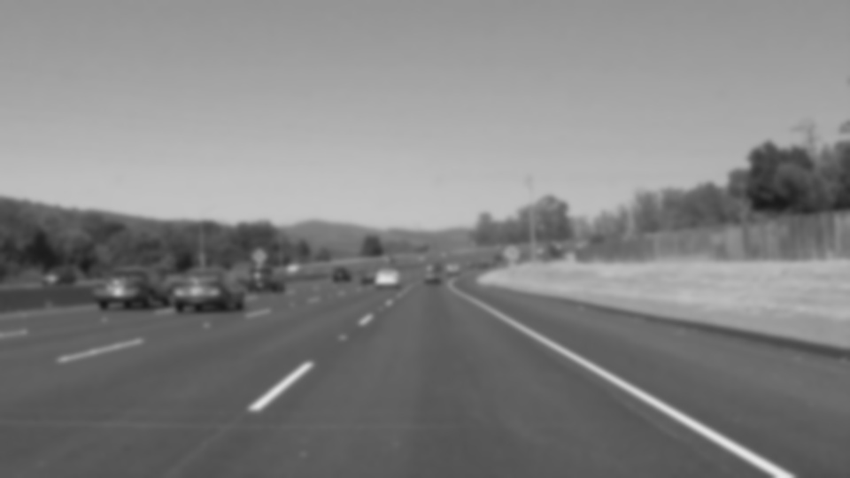
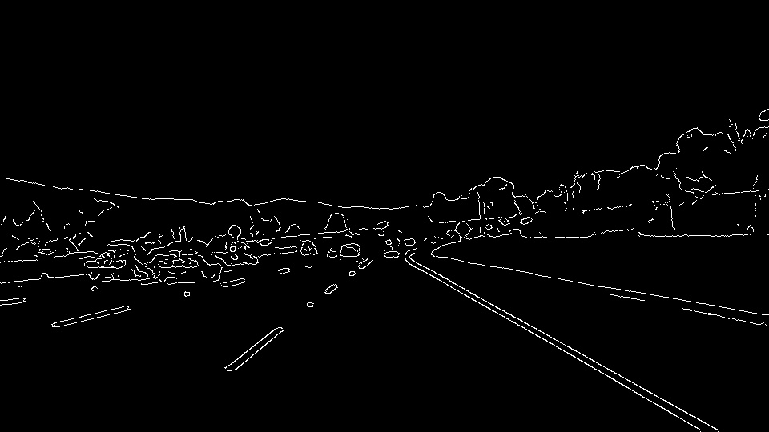
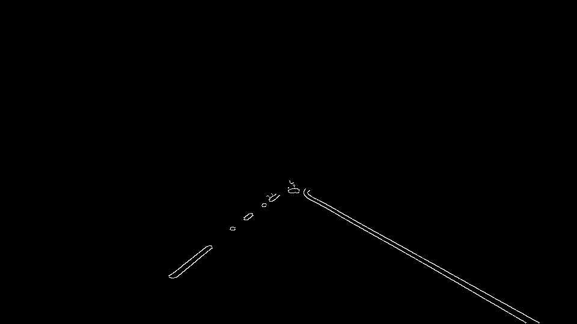
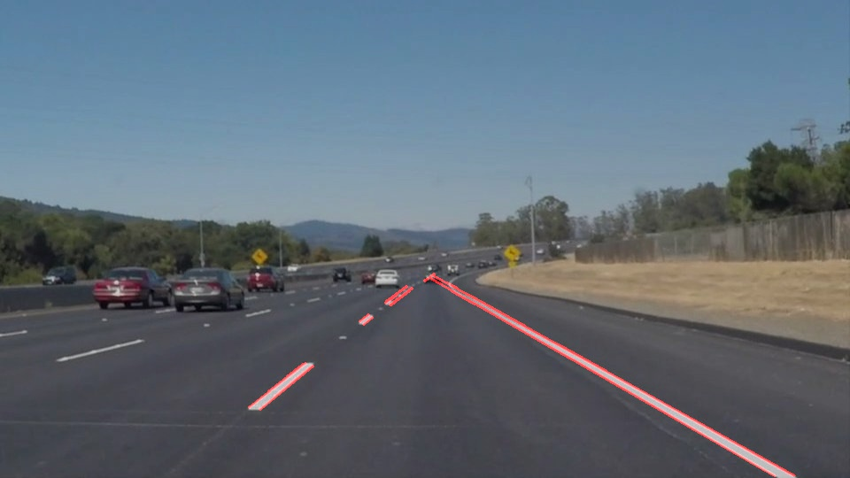
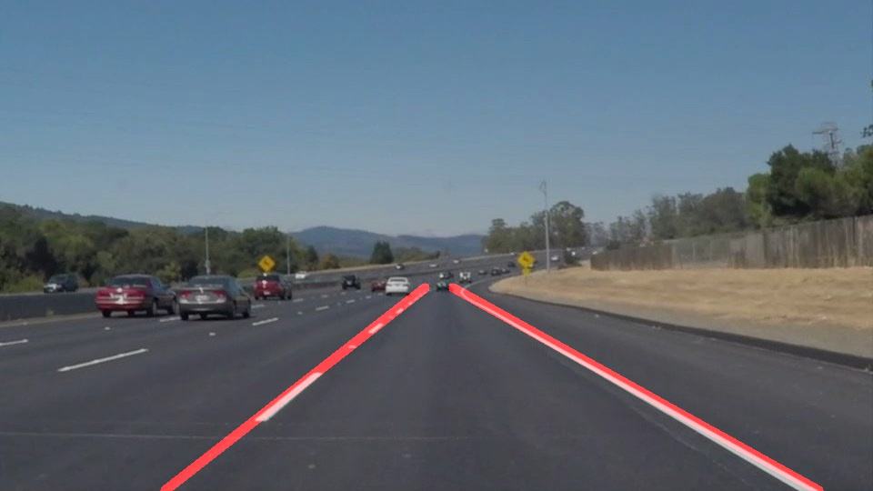

# **Finding Lane Lines on the Road** 

---

**Finding Lane Lines on the Road**

The goals / steps of this project are the following:
* Make a pipeline that finds lane lines on the road
* Reflect on your work in a written report

[//]: # (Image References)

---

### Reflection

### 1. Describe your pipeline. As part of the description, explain how you modified the draw_lines() function.

My pipeline consisted of 6 steps.
  1. convert the images to grayscale.
  
  1. apply gaussian blur with kernel size 15 on the gray image.
  
  1. apply canny edge detection with low_threshold=30 and high_threshold=40.
  
  1. find a polygon region which covers the two lines of current vehicle, and use it to only keep the region of the edges defined by the polygon.
  
  1. find hough lines from the masked edges.
  
  1. Finally combine the lines with the image to get the annotated image.
  

In order to draw a single line on the left and right lanes, I modified the draw_lines() function as following:
  1. For each hough line, get its slope and intercept.
  1. If slope is negative, put it into the left group, otherwise the right group.
  1. Calculate the median slope and intercept for each group. So each group only prerents one line.
  1. To make the lines more stable when crossing frames, I also used historical slopes and intercepts with a time-decay function. For example, slope = previous_slope * 0.5 + current_slope, then let previous_slope = slope. I need to do it separately for both groups.
  1. Find the cross point of the two lines, and cut it off a little bit so they don't actually cross, which makes it more like the example image.
  1. Find the bottom points of the two lines.
  1. Draw tow lines on the image, one for each group.

### 2. Identify potential shortcomings with your current pipeline

This simple approach has many potential shortcomings. For example,
   1. Current I hard code the polygon region to cover the two lines, but it won't work very well on different image size, or when the vehical is not roughly in the center of a lane.
   1. It can't work well when there is three or more constant lines in the region of interest.
   1. It can't work well on curly lane lines.
   1. If the lane lines are not very visible, the detection may fail.
   1. If the camera is partial blocked by the car body, or the window is dirty, some constant edges or lines can appear.

### 3. Suggest possible improvements to your pipeline

One potential improvement could be to avoid hard coding the region of interest

Another possible improvement would be to use machine learning or deep learning model to detect the lines, so the detection can be more reliable.